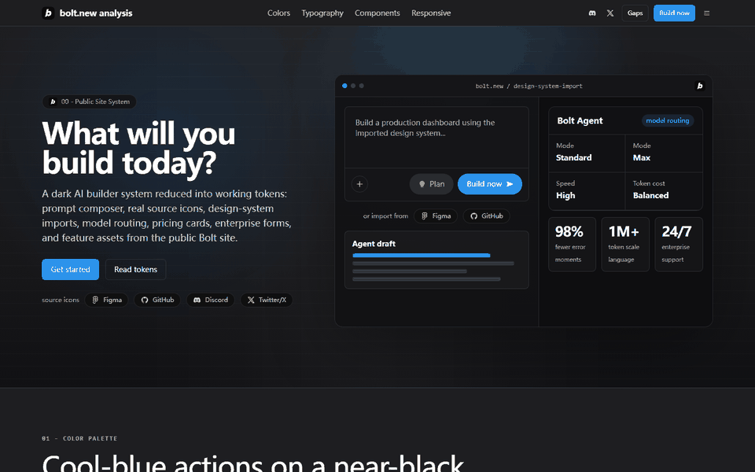
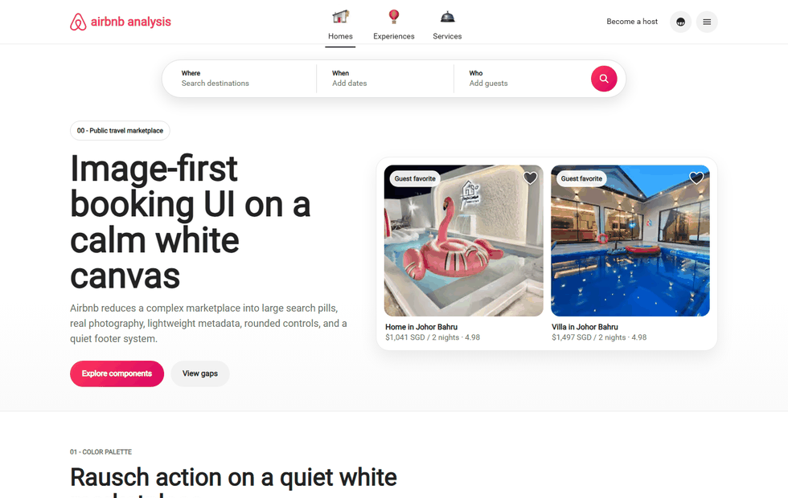

<p align="center">
  
</p>

<p align="center">
  把任意网站拆解成中英双语 DESIGN.md、浏览器验收过的 Preview HTML，以及可复用的 Codex 案例。
</p>

<p align="center">
  <strong>中文</strong> · <a href="README.md">English</a>
</p>

<p align="center">
  
  
  
  
</p>

# Website Design System Teardown

把一个网站 URL 发给 Codex，让它使用这套 Skill，就能得到一套可交付的设计系统拆解包。后续其他 AI agent 可以直接读取这套 DESIGN.md，再去生成风格一致的 UI。

这个仓库参考了 [VoltAgent/awesome-design-md](https://github.com/VoltAgent/awesome-design-md) 的对外展示方式：用简洁条目展示 DESIGN.md 案例，说明每个网站的视觉系统，并保留足够的视觉证据和实现规则。

## 什么是 DESIGN.md？

[DESIGN.md](https://stitch.withgoogle.com/docs/design-md/overview/) 是给 AI agent 读取的纯文本设计系统文档。它描述一个产品应该长什么样、有什么气质、怎么排版、怎么用颜色、怎么做组件、怎么响应式适配。

它和项目里的 agent 指令可以放在一起：

| 文件 | 谁会读 | 定义什么 |
|------|--------|----------|
| `AGENTS.md` | Coding agents | 项目怎么开发、怎么运行、有什么约束 |
| `DESIGN.md` | Design / coding agents | UI 应该怎么长、怎么动、怎么保持一致 |

这套 Skill 会从真实网站拆出中英双语 DESIGN.md，并额外生成一个可在浏览器里检查的 `preview.html`。

## 案例

### Developer Tools & IDEs

- [**Bolt.new**](cases/developer-tools-ides/bolt-new/design-system-analysis/bolt-new-DESIGN.zh-CN.md) - AI 编程和 Web App 构建工具。深色工作台画布、冷蓝主行动按钮、源站真实图标、prompt 输入器、模型路由卡片、价格表、集成卡片和企业表单共同构成开发工具感。

Preview:


案例文件：

| 文件 | 用途 |
|------|------|
| [`DESIGN.zh-CN.md`](cases/developer-tools-ides/bolt-new/design-system-analysis/bolt-new-DESIGN.zh-CN.md) | 中文设计系统拆解 |
| [`DESIGN.en-US.md`](cases/developer-tools-ides/bolt-new/design-system-analysis/bolt-new-DESIGN.en-US.md) | 英文设计系统拆解 |
| [`preview.html`](cases/developer-tools-ides/bolt-new/design-system-analysis/bolt-new-preview.html) | 可浏览器检查的视觉预览 |
| [`metadata.md`](cases/developer-tools-ides/bolt-new/metadata.md) | 来源 URL、分类、访问状态、已检查页面和已知缺口 |

### 旅行与住宿

- [**Airbnb**](cases/travel-hospitality/airbnb/design-system-analysis/airbnb-DESIGN.zh-CN.md) - 公开旅行交易平台。白色画布、Airbnb Cereal 字体、Rausch 红粉行动色、源站 Homes / Experiences / Services 顶部图标、胶囊搜索、图片优先房源卡、房东招募模块、帮助中心表面和响应式卡片行为共同构成这套系统。

Preview:



案例文件：

| 文件 | 用途 |
|------|------|
| [`DESIGN.zh-CN.md`](cases/travel-hospitality/airbnb/design-system-analysis/airbnb-DESIGN.zh-CN.md) | 中文设计系统拆解 |
| [`DESIGN.en-US.md`](cases/travel-hospitality/airbnb/design-system-analysis/airbnb-DESIGN.en-US.md) | 英文设计系统拆解 |
| [`preview.html`](cases/travel-hospitality/airbnb/design-system-analysis/airbnb-preview.html) | 可浏览器检查的视觉预览 |
| [`metadata.md`](cases/travel-hospitality/airbnb/metadata.md) | 来源 URL、分类、访问状态、已检查页面、验收记录和已知缺口 |

## 这个案例格式包含什么

每个案例都保持同一套结构：

| # | 模块 | 记录内容 |
|---|------|----------|
| 1 | Front matter | 来源 URL、已检查页面、颜色、字体、间距、圆角、组件等机器可读信息 |
| 2 | Overview | 网站的整体视觉语言，以及适合用在哪类 UI |
| 3 | Colors | 语义色名、hex 值、功能角色和使用位置 |
| 4 | Typography | 字体、层级、字号、字重、行高和使用规则 |
| 5 | Layout | 容器、栅格、区块节奏、密度和对齐方式 |
| 6 | Elevation & Depth | 边框、阴影、叠层、模糊、渐变和表面层级 |
| 7 | Shapes | 圆角体系、媒体比例、图标语言和重复视觉符号 |
| 8 | Components | 导航、按钮、卡片、表单、Tab、价格表、仪表盘和品牌特征组件 |
| 9 | Do's and Don'ts | 后续扩展时应该做什么、不要做什么 |
| 10 | Responsive Behavior | 断点、导航折叠、栅格变化、触控尺寸和移动端变化 |
| 11 | Iteration Guide | 后续 agent 怎么基于这套系统继续做新 UI |
| 12 | Known Gaps | 未检查页面、登录后界面、失败资源、未测试交互等限制 |

每个案例包含：

| 文件 | 用途 |
|------|------|
| `design-system-analysis/<site>-DESIGN.zh-CN.md` | 完整中文版 |
| `design-system-analysis/<site>-DESIGN.en-US.md` | 完整英文版 |
| `design-system-analysis/<site>-preview.html` | 自包含 HTML 预览；能用源站公开资产时必须使用真实资产 |
| `metadata.md` | 案例索引、分类和验证边界 |

## Preview HTML 标准

Preview 不是装饰，它是拆解结果的视觉证明。

合格的 Preview 必须做到：

- 使用和 Markdown 文档一致的 token 与组件规则。
- 首屏要像目标网站自己的设计系统预览，而不是普通说明页。
- 当源站公开暴露 logo、favicon、SVG 图标、产品图、截图、合作伙伴标识或 UI mock 时，优先使用这些真实资产。
- 不用假图标、emoji、单字母 logo 方块、灰盒、渐变盒和编造的产品截图顶替真实资产。
- 有足够的领域组件，不只是通用卡片和按钮。
- 必须在真实浏览器里检查桌面和移动端宽度。

## 安装到 Codex

把这个仓库安装成 Codex 全局 Skill。

PowerShell：

```powershell
$skills = "$env:USERPROFILE\.codex\skills"
New-Item -ItemType Directory -Force $skills | Out-Null
git clone https://github.com/hhu122392/website-design-system-teardown.git "$skills\website-design-system-teardown"
```

macOS / Linux：

```bash
mkdir -p ~/.codex/skills
git clone https://github.com/hhu122392/website-design-system-teardown.git ~/.codex/skills/website-design-system-teardown
```

后续更新：

```powershell
git -C "$env:USERPROFILE\.codex\skills\website-design-system-teardown" pull
```

## 在 Codex 里使用

打开 Codex，并确保 Browser / @browser 插件可用，然后这样说：

```text
使用 $website-design-system-teardown 和 @浏览器 拆解 https://example.com 的设计系统。
输出中文和英文 DESIGN.md，输出 preview.html，并按分类保存案例。
```

英文也可以这样说：

```text
Use $website-design-system-teardown with @browser to analyze https://example.com.
Create Chinese and English DESIGN.md files, create preview HTML, and save the case by category.
```

如果目标网站的关键界面需要登录，Codex 应该让你在浏览器里协助登录。不要在聊天里发送密码、cookie、token 或私人账号数据。

## 仓库结构

```text
website-design-system-teardown/
  SKILL.md
  README.md
  README.zh-CN.md
  agents/
  assets/
  references/
    design-md-breakdown-standard.md
    design-system-output-template.md
    preview-html-standard.md
    login-collaboration.md
  cases/
    CASE_COLLECTION.md
    developer-tools-ides/
      bolt-new/
        metadata.md
        design-system-analysis/
          bolt-new-DESIGN.zh-CN.md
          bolt-new-DESIGN.en-US.md
          bolt-new-preview.html
    travel-hospitality/
      airbnb/
        metadata.md
        design-system-analysis/
          airbnb-DESIGN.zh-CN.md
          airbnb-DESIGN.en-US.md
          airbnb-preview.html
```

## 贡献案例

每个网站一个案例文件夹：

```text
cases/<category>/<site-slug>/
  metadata.md
  design-system-analysis/
    <site-slug>-DESIGN.zh-CN.md
    <site-slug>-DESIGN.en-US.md
    <site-slug>-preview.html
```

证据要诚实。没有检查过的页面、没有进入的登录后界面、加载失败的资产、没有测试过的交互，都要写进 Known Gaps。

## License

MIT License。所有设计系统拆解都是基于公开可见页面的独立观察。本仓库不声明拥有任何品牌、商标、logo 或源站视觉资产的所有权。
